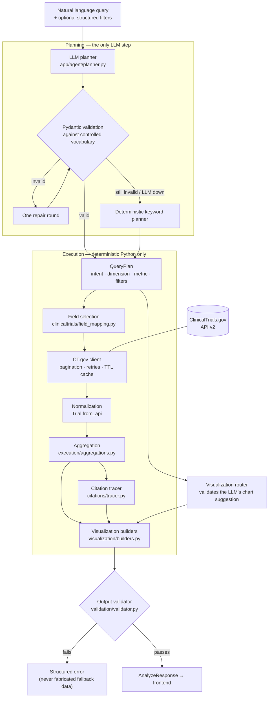

# ClinicalTrials.gov Query-to-Visualization Agent

Ask a question about clinical trials in plain English. Get back a **validated,
frontend-renderable visualization specification** built from live
ClinicalTrials.gov data, where every data point links back to the study records
that produced it.

```
"Which countries have the most recruiting trials for Alzheimer's disease?"
   → bar_chart, top 15 countries, 832 studies, every bar citing real NCT IDs
```

---

## Table of contents

- [What it does](#what-it-does)
- [Architecture](#architecture)
- [Why this architecture](#why-this-architecture)
- [Running locally](#running-locally)
- [API documentation](#api-documentation)
- [Supported query classes](#supported-query-classes)
- [Visualization types](#visualization-types)
- [Deep citations](#deep-citations)
- [Validation](#validation)
- [Error handling](#error-handling)
- [Testing](#testing)
- [Example runs](#example-runs)
- [Design decisions and tradeoffs](#design-decisions-and-tradeoffs)
- [Limitations](#limitations)
- [Future improvements](#future-improvements)
- [AI tools used](#ai-tools-used)

---

## What it does

1. **Interprets** the question with an LLM that is constrained to a fixed
   vocabulary — it produces a *plan*, never an answer.
2. **Retrieves** real studies from the ClinicalTrials.gov v2 API, with
   pagination, retries, field selection and a TTL cache.
3. **Normalizes** the deeply nested API payload into a flat, missing-data-safe
   `Trial` model.
4. **Aggregates** deterministically in Python — every count, sum, median, bin
   and edge weight.
5. **Builds** a generic visualization specification (type, title, encoding,
   data, metadata).
6. **Traces** each datum back to the NCT IDs and exact field values behind it.
7. **Validates** the spec before returning it, and refuses to return a chart it
   cannot vouch for.

**The LLM never produces a count, a year, a sponsor name, a country or an NCT
ID.** If a value appears in a chart, a retrieved ClinicalTrials.gov record
produced it.

---

## Architecture



### Repository layout

```
backend/
  app/
    main.py                     FastAPI app, CORS, global error handlers
    config.py                   env-driven settings
    logging_utils.py            structured JSON logs, secret scrubbing
    api/
      routes.py                 /analyze, /health, /examples
      schemas.py                public request/response models
    agent/
      intent.py                 the controlled vocabulary (enums + QueryPlan)
      prompts.py                planner prompt
      llm.py                    OpenAI-compatible client
      planner.py                LLM planning, validation, repair, fallback
    clinicaltrials/
      client.py                 async API client: pagination, retries, cache
      models.py                 normalized Trial model
      field_mapping.py          plan → the CT.gov fields to request
    execution/
      aggregations.py           ALL numeric work (counts, bins, networks)
      executor.py               orchestrates retrieval → chart
    visualization/
      schemas.py                the output contract
      router.py                 intent → chart type (validates LLM suggestion)
      builders.py               one builder per chart type
    citations/
      tracer.py                 deep citations
    validation/
      validator.py              final gate on the spec
  tests/                        87 unit tests + 2 optional live tests
frontend/                       React + TypeScript demo
examples/                       actual generated outputs (not handwritten)
```

---

## Why this architecture

### Why LLM planning is separated from execution

Language models are good at reading intent out of ambiguous prose and bad at
arithmetic over thousands of records. So the LLM does exactly one job: it turns
`"how have trials for this drug changed over time?"` into

```json
{"intent": "time_trend", "search_terms": ["Pembrolizumab"], "dimension": "year",
 "metric": "trial_count", "filters": {"start_year": 2015}}
```

and then it is out of the loop. `Executor` does the retrieval, `aggregations.py`
does the counting, `builders.py` shapes the output. This is what makes the
numbers trustworthy: there is no code path by which a model-generated token can
become a bar height.

### How hallucination is constrained

Five independent mechanisms, in order of execution:

| # | Mechanism | Where | What it prevents |
|---|-----------|-------|------------------|
| 1 | Controlled vocabulary — every planner field is an enum | `agent/intent.py` | Invented intents, dimensions, chart types, filter keys (`extra="forbid"`) |
| 2 | Strict Pydantic validation + one bounded repair round | `agent/planner.py` | Structurally invalid plans reaching execution |
| 3 | Deterministic fallback planner | `agent/planner.py` | An LLM outage becoming a service outage |
| 4 | Deterministic visualization router | `visualization/router.py` | A chart type the intent's data cannot fill |
| 5 | Output validator | `validation/validator.py` | Broken encodings, NaN values, citations to studies never retrieved |

The LLM is also never given executable anything: no SQL, no Python, no raw
query strings that bypass the client. It picks from a menu.

### How visualization selection works

`router.py` holds `DEFAULT_BY_INTENT` and `ALLOWED_BY_INTENT`. The planner may
*suggest* a chart, and the suggestion is honoured only if it is in the allow-list
for the resolved intent — `time_trend` may legitimately be a `bar_chart`, but a
`relationship` can never be a `scatter_plot`, because the relationship pipeline
produces nodes and edges, not points. Overrides are reported in
`visualization.metadata.notes` rather than silently applied.

### How pagination works

`ClinicalTrialsClient.search_studies` loops on `nextPageToken` until the token is
absent or the configured cap (`CTGOV_MAX_STUDIES`, default 5000) is reached. It
never stops at page one. When the cap *is* hit, the response says so:
`metadata.truncated = true` plus an explicit note that counts reflect a sample.
An honest caveat beats a quietly wrong number.

### How field selection works

`field_mapping.fields_for_plan(plan)` returns only the CT.gov fields the chosen
aggregation reads. A phase distribution requests `NCTId,BriefTitle,Phase`; a
sponsor↔drug network requests sponsor and intervention fields. This keeps
multi-thousand-study fetches fast and payloads small.

---

## Running locally

**Prerequisites:** Python 3.11+ and Node 18+.

### Backend

```bash
git clone https://github.com/Susmithay08/Cheiron.git
cd Cheiron

cp .env.example .env
# Edit .env and set LLM_API_KEY (any OpenAI-compatible key).
# ClinicalTrials.gov itself needs no key.

cd backend
python -m venv .venv
source .venv/bin/activate         # Windows: .venv\Scripts\activate
pip install -r requirements.txt

uvicorn app.main:app --reload --port 8000
```

- API: <http://127.0.0.1:8000>
- Interactive docs: <http://127.0.0.1:8000/docs>

The service runs **without** an LLM key too — the deterministic keyword planner
takes over and `meta.plan.planner_mode` reports `"heuristic"`.

### Frontend

```bash
cd frontend
npm install
npm run dev
```

Open <http://localhost:5173>. Vite proxies `/api/*` to the backend, so the
browser never holds an API key and never calls ClinicalTrials.gov directly.

### Configuration

All settings come from environment variables (see `.env.example`):

| Variable | Default | Purpose |
|----------|---------|---------|
| `LLM_API_KEY` | *(empty)* | Enables the LLM planner. Empty ⇒ heuristic planner. |
| `LLM_MODEL` | `gpt-4.1-mini` | Planning model. |
| `LLM_BASE_URL` | `https://api.openai.com/v1` | Any OpenAI-compatible endpoint. |
| `CTGOV_PAGE_SIZE` | `1000` | Studies per API page. |
| `CTGOV_MAX_STUDIES` | `5000` | Pagination cap per search term. |
| `CTGOV_CACHE_TTL_SECONDS` | `900` | In-process cache for identical requests. |
| `MAX_CITATIONS_PER_DATUM` | `5` | Full citations attached per data point. |
| `CORS_ORIGINS` | `http://localhost:5173,...` | Comma-separated allowed origins. |

`.env` is gitignored; no key is ever logged, returned or sent to the browser.

---

## API documentation

### `POST /analyze`

#### Request

| Field | Type | Required | Validation | Description |
|-------|------|----------|-----------|-------------|
| `query` | string | **yes** | 3–500 chars, non-blank | Natural-language question. |
| `drug_name` | string | no | ≤120 chars | Restrict to this intervention. |
| `condition` | string | no | ≤120 chars | Restrict to this condition/disease. |
| `trial_phase` | enum | no | `EARLY_PHASE1 \| PHASE1 \| PHASE2 \| PHASE3 \| PHASE4 \| NA` | Keep only this phase. |
| `sponsor` | string | no | ≤200 chars | Restrict to this lead sponsor. |
| `country` | string | no | ≤100 chars | Restrict to studies with a site here. |
| `start_year` | integer | no | 1900–2100 | Earliest study start year (inclusive). |
| `end_year` | integer | no | 1900–2100 | Latest study start year (inclusive). |
| `status` | enum | no | `RECRUITING \| COMPLETED \| TERMINATED \| …` | Overall recruitment status. |

Structured fields are **authoritative**: they override whatever the planner
inferred from the prose.

```json
{
  "query": "How has the number of trials for this drug changed per year since 2015?",
  "drug_name": "Pembrolizumab",
  "start_year": 2015
}
```

#### Response

```jsonc
{
  "visualization": {
    "type": "time_series",              // bar_chart | grouped_bar_chart | time_series
                                        // | scatter_plot | histogram | network_graph
    "title": "Pembrolizumab Trials per Start Year",
    "description": "Number of studies whose start date falls in each year…",
    "encoding": {
      "x": { "field": "year",        "type": "temporal",     "title": "Start Year" },
      "y": { "field": "trial_count", "type": "quantitative", "title": "Number of Trials" },
      "series": null                    // present for grouped charts
    },
    "data": [
      {
        "year": "2015",
        "trial_count": 117,
        "citations": [ /* see Deep citations */ ],
        "supporting_trial_count": 117,
        "supporting_nct_ids": ["NCT02260440", "…"]
      }
    ],
    "nodes": null,                      // network_graph only
    "edges": null,                      // network_graph only
    "metadata": {
      "source": "ClinicalTrials.gov",
      "source_api": "https://clinicaltrials.gov/api/v2/studies",
      "metric": "trial_count",
      "unit": "trials",
      "sort": { "field": "year", "direction": "asc" },
      "time_granularity": "year",
      "grouping": "year",
      "filters_applied": { "start_year": 2015 },
      "search_terms": ["Pembrolizumab"],
      "studies_retrieved": 3092,
      "studies_matched": 3026,
      "truncated": false,
      "assumptions": ["The user wants annual counts from 2015 onwards"],
      "notes": []
    }
  },
  "meta": {
    "request_id": "b1f2c3d4e5f6",
    "query": "How has the number of trials…",
    "elapsed_ms": 8927,
    "plan": {
      "intent": "time_trend",
      "search_terms": ["Pembrolizumab"],
      "dimension": "year",
      "metric": "trial_count",
      "relationship": null,
      "filters": { "start_year": 2015 },
      "interpretation": "Number of trials involving Pembrolizumab each year since 2015",
      "planner_mode": "llm"
    }
  }
}
```

**The renderer contract:** `encoding.<channel>.field` always names a key present
on every object in `data`. A frontend switches on `type`, reads `encoding`, and
renders — no backend-specific knowledge required. `frontend/src/charts/VisualizationRenderer.tsx`
is that switch, in 20 lines, and it is the proof the contract holds.

For `network_graph`, `data` is empty and the payload lives in `nodes` / `edges`,
addressed by `encoding.node_id`, `encoding.edge_source`, `encoding.edge_target`,
`encoding.edge_weight`.

#### Other endpoints

| Endpoint | Purpose |
|----------|---------|
| `GET /health` | Liveness + whether an LLM is configured (never the key). |
| `GET /examples` | Curated demo queries, one per intent — powers the UI chips. |
| `GET /docs` | Interactive OpenAPI docs with request/response examples. |

---

## Supported query classes

One coherent pipeline covers all six. Adding a seventh means adding an enum
value, an extractor and a builder — not a new code path.

| Intent | Example question | Dimension | Chart |
|--------|------------------|-----------|-------|
| `time_trend` | "How has the number of trials for Pembrolizumab changed per year since 2015?" | `year` | `time_series` |
| `distribution` | "How are breast cancer trials distributed across phases?" | `phase`, `status`, `study_type`, `intervention_type`, `sponsor`, `sponsor_class`, `condition` | `bar_chart` / `histogram` |
| `comparison` | "Compare trial counts by phase for Ozempic vs Wegovy" | any of the above, per series | `grouped_bar_chart` |
| `geographic` | "Which countries have the most recruiting trials for Alzheimer's disease?" | `country` | `bar_chart` |
| `relationship` | "Show a network of sponsors and drugs for diabetes trials" | `sponsor_drug`, `drug_drug`, `condition_intervention`, `sponsor_condition` | `network_graph` |
| `correlation` | "Is there a relationship between enrollment and start year for melanoma trials?" | `enrollment`, `start_year`, `duration_days` | `scatter_plot` |

Metrics available on every categorical intent: `trial_count`,
`enrollment_sum`, `enrollment_median`.

---

## Visualization types

| Type | Data shape | Notes |
|------|-----------|-------|
| `bar_chart` | rows of `{dimension, value, citations}` | Ordinal dimensions (phase, status) keep clinical order; others sort by value desc and truncate to `top_n`. |
| `grouped_bar_chart` | as above plus `series` | Each series is an independent CT.gov search; a study matching both terms counts in both, and the description says so. |
| `time_series` | rows keyed by `year` | Missing years are emitted as explicit zeros so the line does not imply continuity it lacks. |
| `histogram` | rows of `{bin, trial_count}` | Equal-width bins over a numeric field; single-value inputs collapse to one bin. |
| `scatter_plot` | one row per study | Studies missing either axis are **omitted, never imputed**; the count omitted is reported. Capped at 500 points, and the cap is disclosed. |
| `network_graph` | `nodes[]` + `edges[]` | See below. |

### Making the network meaningful

An unpruned sponsor↔drug graph for "diabetes" has thousands of degree-1 nodes
and communicates nothing. Three deliberate choices:

1. **Prune by connectivity** — keep the `top_n` busiest entities *per group*, so
   both sponsors and drugs stay represented, then keep the strongest edges
   between survivors.
2. **Drop uninformative nodes** — `Placebo`, `Saline`, `Standard of Care` and
   friends are real interventions, but "Sponsor X — Placebo" says nothing about
   what a sponsor develops. They are excluded from networks only (they still
   count in distributions).
3. **Weight edges by evidence** — edge weight is the number of studies in which
   the pair co-occurs, and each edge cites those studies.

The result is legible: for diabetes, `Novo Nordisk ↔ insulin aspart (17)`,
`AstraZeneca ↔ Dapagliflozin (11)` — a real picture of who develops what.

---

## Deep citations

Every visualized datum carries three things:

```jsonc
{
  "phase": "Phase 3",
  "trial_count": 41,
  "citations": [                         // capped, fully detailed
    {
      "nct_id": "NCT02260440",
      "field": "protocolSection.designModule.phases",   // exact API path
      "value": "Phase 3",                               // exact value read
      "excerpt": "A Phase 2 Study of Pembrolizumab (MK-3475) in Combination…",
      "url": "https://clinicaltrials.gov/study/NCT02260440"
    }
  ],
  "supporting_trial_count": 41,          // complete count
  "supporting_nct_ids": ["NCT…", "…"]    // complete ID list (to 200)
}
```

### The strategy, and why

A phase bar can rest on 1,500 studies. Emitting 1,500 full citations per bar
would produce a multi-megabyte response nobody can read. So:

- **Detail is capped** at `MAX_CITATIONS_PER_DATUM` (default 5) full citations
  per datum, selected deterministically (sorted by NCT ID) so the same query
  returns the same citations.
- **Provenance is complete**: `supporting_trial_count` is the true count, and
  `supporting_nct_ids` lists the contributing studies, so an auditor can pull
  any of them.
- **Citations are specific, not generic.** Each names the CT.gov field path the
  value came from and the value itself — `startDateStruct.date: "2022-03-10"`
  for a 2022 time bucket, `leadSponsor.name ↔ intervention` for a network edge.
- **Scatter points cite both of their own axes** (one study, two field values).
- **Nothing is cited that was not retrieved.** `CitationTracer` builds from an
  index of the actual fetched trials and returns `None` for anything else; the
  output validator then re-checks every citation against the retrieved ID set
  and refuses the response if one does not match.

In the frontend, clicking any bar, point or edge opens the citation panel with
clickable NCT links, the supporting field values, and an expandable list of all
contributing IDs.

---

## Validation

| Stage | Checks |
|-------|--------|
| **Input** | Query present, 3–500 chars, non-blank; years in 1900–2100 and ordered; enums valid; unknown fields rejected. |
| **Planner output** | Intent, dimension, metric, relationship, chart type and every filter key validated against enums; `extra="forbid"`; comparison requires ≥2 terms; correlation requires two distinct axes; safely repairable shapes (e.g. `time_trend` with a non-year dimension) are corrected rather than rejected. |
| **API response** | Payload must be a dict; `studies` must be a list; pagination consistency; every study missing an NCT ID is dropped; every optional nested field is missing-safe. |
| **Visualization** | Every encoding channel names a field present in `data`; quantitative channels are numeric and finite (no NaN/inf); network edges point at existing nodes; edge weights numeric; empty charts rejected. |
| **Citations** | Every cited NCT ID must appear in the set of studies this request actually retrieved. |

On failure the service returns a structured error. It never substitutes
fabricated fallback data — an honest error is more useful than a plausible chart.

---

## Error handling

```json
{
  "error": {
    "code": "NO_MATCHING_TRIALS",
    "message": "No ClinicalTrials.gov studies matched the supplied query and filters.",
    "details": { "search_terms": ["zzqqxx-nonexistent-compound"],
                 "studies_retrieved_before_filters": 0 },
    "request_id": "444ed1ca1836"
  }
}
```

| Code | HTTP | Cause |
|------|------|-------|
| `INVALID_REQUEST` | 422 | Request schema violation; `details.fields` lists each problem. |
| `NO_MATCHING_TRIALS` | 404 | Search + filters matched nothing. |
| `INSUFFICIENT_FIELD_COVERAGE` | 422 | Studies matched but none report the needed field. |
| `INSUFFICIENT_RELATIONSHIPS` | 422 | Not enough linked entities to form a network. |
| `CTGOV_UNAVAILABLE` | 502 | CT.gov down/rate-limited after retries. |
| `CTGOV_BAD_QUERY` | 502 | CT.gov rejected the constructed query. |
| `INVALID_VISUALIZATION` | 500 | The spec failed output validation and was withheld. |
| `INTERNAL_ERROR` | 500 | Anything unhandled. Stack traces go to logs, never to the client. |

**Ambiguous queries** are answered, not refused. "Show me trials for cancer"
runs the broad search and records the interpretation in
`metadata.assumptions` and `meta.plan.interpretation`, so the user can see
exactly what was assumed.

### Observability

Structured JSON logs, one line per event, correlated by `request_id`:
`request_received → planner_completed → ctgov_request → ctgov_pagination_complete
→ normalized → retrieval_complete → visualization_built → request_completed`.
Any field whose name looks like a credential is scrubbed before logging.

---

## Testing

```bash
cd backend
pytest                      # 87 unit tests, no network access
pytest -m live -o addopts=-q  # 2 optional tests against the real CT.gov API
```

```
87 passed, 2 deselected in 9.5s
```

All external calls are mocked (`respx` for HTTP, a stub for the LLM), so the
suite is deterministic and runs offline. Coverage by area:

| File | Tests |
|------|-------|
| `test_models.py` | Sparse records, partial dates (`2019`, `2019-07`), missing NCT IDs, multi-phase studies, invalid date ranges. |
| `test_aggregations.py` | Phase/year/country counts, ordinal ordering, gap filling, `top_n`, metrics ignoring missing values, network weights and pruning, scatter exclusions, histogram edge cases. |
| `test_planner.py` | Valid plans, invented intents/dimensions/chart types, injected `sql`/`python` keys dropped, comparison/correlation constraints, repair round, fallback on LLM failure, structured-filter precedence, all six heuristic intents. |
| `test_client.py` | Multi-page pagination with tokens, cap enforcement, retry on 5xx, no-retry on 400, malformed payloads, cache hits, filter push-down. |
| `test_visualization.py` | Router defaults and overrides, encoding/data agreement, citation correctness and capping, refusal to cite unretrieved trials, and five validator rejection cases. |
| `test_api.py` | Happy path, citation integrity, empty results, CT.gov outage, LLM failure fallback, insufficient coverage, six malformed requests, health/examples/OpenAPI. |
| `test_live_ctgov.py` | Real API shape and filter behaviour (opt-in). |

---

## Example runs

`examples/` holds the **actual JSON** returned by the running service — generated
by posting to `/analyze`, not written by hand. `examples/README.md` indexes them.

| File | Query | Result |
|------|-------|--------|
| `01_time_trend.json` | "How has the number of trials for this drug changed per year since 2015?" (`drug_name: Pembrolizumab`) | `time_series`, 13 year buckets |
| `02_distribution.json` | "How are breast cancer trials distributed across phases?" | `bar_chart`, 6 phases |
| `03_comparison.json` | "Compare trial counts by phase for Ozempic vs Wegovy" | `grouped_bar_chart`, 2 series × 6 phases |
| `04_geographic.json` | "Which countries have the most recruiting trials for Alzheimer's disease?" | `bar_chart`, top 15 countries |
| `05_network.json` | "Show a network of sponsors and drugs for diabetes trials" | `network_graph`, 29 nodes, 56 edges |
| `06_correlation.json` | "Is there a relationship between enrollment and start year for melanoma trials?" | `scatter_plot`, 500 studies |
| `07_error_no_matching_trials.json` | "How many trials exist for zzqqxx-nonexistent-compound?" | `404 NO_MATCHING_TRIALS` |
| `08_histogram.json` | "Show the distribution of enrollment sizes for glioblastoma trials" | `histogram`, 13 bins incl. a disclosed overflow bin |

Regenerate them at any time against a running backend — the numbers move as the
registry does, which is the point.

---

## Design decisions and tradeoffs

**LLM for planning, Python for facts.** The single most important decision.
It costs some flexibility — the system can only answer questions expressible in
the vocabulary — and buys correctness that can be tested, and a service that
still works when the LLM provider does not.

**A deterministic fallback planner.** ~80 lines of keyword matching covering all
six intents. It is not as good as the LLM at ambiguous prose, and it does not
need to be: it exists so an LLM outage degrades quality instead of causing an
outage, and so the whole system is demonstrable without a key. `planner_mode` in
every response says which path ran.

**Enums over free text in the plan.** `extra="forbid"` on the plan models means
an LLM that emits `{"sql": "..."}` or `{"dimension": "investigator_seniority"}`
gets rejected at the schema boundary, before any I/O.

**Pagination cap with disclosure.** 5,000 studies per term keeps latency in the
seconds for even the largest drugs. When it binds, `truncated: true` and an
explicit note appear. The alternative — silently charting page one — is the
failure mode this design is most concerned with.

**Field selection driven by the plan.** A phase distribution fetches three
fields, not the full study record. This is the difference between a 4-second and
a 40-second response on a 5,000-study query.

**In-process TTL cache, not Redis.** A dict with timestamps, 15-minute TTL, 256
entries. A single-process demo service does not justify an infrastructure
dependency; the tradeoff is that the cache dies with the process and does not
help across replicas. Swapping in Redis means replacing one class.

**Citations capped, provenance complete.** Detail is bounded at 5 citations per
datum; the full contributing NCT ID list and true count always ship. Full
citations for every study would make responses unusable.

**Multi-country counting.** A trial running in 12 countries counts once per
country, so country bars sum to more than the study count. That is the right
answer for "which countries have the most trials", and the chart's `description`
states it rather than leaving the reader to wonder.

**Comparison series are independent searches.** For "Ozempic vs Wegovy", each
term is its own CT.gov query, so a study naming both appears in both series.
The alternative (mutually exclusive buckets) would misrepresent both drugs.
Stated in the description; per-series study counts are in `metadata.notes`.

**Missing data is excluded, never imputed.** A study with no enrollment is
dropped from an enrollment scatter and the exclusion is counted and reported. No
zero-filling, no interpolation — except time-series gap years, which are
genuinely zero and are labelled as such.

**Flat normalization at the boundary.** `Trial.from_api` absorbs all the nesting
and optionality once, so no downstream module contains a defensive `.get()`
chain. `Trial` is a plain dataclass, which also makes aggregation tests trivial.

---

## Limitations

Stated plainly:

- **Coverage is bounded by the vocabulary.** Questions outside the six intents
  ("what is the median time from phase 2 to phase 3 approval?") get the closest
  supported plan, not a refusal. The interpretation is always disclosed, but a
  user may still get an answer to a nearby question.
- **Search quality is CT.gov's.** `query.term` is a keyword search over the whole
  record, so "breast cancer" can match a lung-cancer study that mentions breast
  cancer in eligibility criteria. Better precision would need field-scoped
  queries (`query.cond` / `query.intr`) chosen per entity type.
- **No synonym expansion.** "Keytruda" and "Pembrolizumab" are different
  searches. A drug-name normalizer (RxNorm/ChEMBL) would fix this.
- **The 5,000-study cap binds on the largest queries.** Disclosed in metadata,
  but counts for very common terms are samples.
- **Geographic output is a bar chart, not a map.** The country data would support
  a choropleth; the renderer does not have one.
- **Year filtering happens client-side**, because CT.gov date-range filters are
  awkward to express. This means a narrow year window still pays for a wide
  fetch.
- **Trials with no start date are dropped by year filters**, which slightly
  undercounts time-filtered results.
- **Network layout is computed in the browser.** Above ~200 nodes the force
  simulation gets sluggish; pruning keeps real responses well below that.
- **The frontend was verified by type-check, production build and module
  compilation, not by automated browser tests** — no browser driver was
  available in the build environment.
- **No auth or rate limiting** on the service itself; it assumes a trusted
  local/demo deployment.

---

## Future improvements

With more time, in priority order:

1. **Field-scoped search routing** — map entity types to `query.cond` /
   `query.intr` / `query.spons` instead of a single `query.term`, which is the
   biggest single win for result precision.
2. **Drug and condition normalization** via RxNorm and MeSH, so "Keytruda",
   "Pembrolizumab" and "MK-3475" resolve to one entity.
3. **`/stats/field/values` for cheap distributions** — CT.gov can return some
   distributions without fetching studies at all; that would remove the
   pagination cap for those queries entirely.
4. **A choropleth renderer** for geographic intents.
5. **Multi-step plans** — "compare the phase distribution of the top 3 sponsors"
   needs a plan that feeds one query's results into the next.
6. **Persistent cache + ETag revalidation**, making repeat queries instant and
   safe across replicas.
7. **Streaming responses**, so the planner's interpretation renders while
   retrieval is still running.
8. **Golden-file tests** that pin example outputs against recorded CT.gov
   fixtures, catching regressions in aggregation logic.
9. **Playwright tests** covering all six chart types in a real browser.

---

## AI tools used

**Claude Code (Claude Opus 5)** was used throughout, and the assignment invites
being specific about the split.

### Deliberately designed (by me, before any code was written)

- The **core thesis**: LLM plans, Python computes; nothing factual crosses that
  line. Every other decision follows from it.
- The **controlled vocabulary** — which intents exist, which dimensions and
  metrics are legal, and the choice to make them enums with `extra="forbid"`
  rather than validated strings.
- The **five-layer anti-hallucination design** (vocabulary → validation → repair
  → router → output validator), including the rule that the backend, not the
  LLM, picks the chart type.
- The **citation strategy** — capped detail plus complete provenance, with the
  field path and exact value, and the rule that the tracer builds only from
  retrieved trials while the validator independently re-checks them.
- The **output contract** — one envelope for six chart types, with `encoding`
  naming keys present in `data`, specifically so a renderer needs no
  backend knowledge.
- The **honesty requirements**: `truncated`, per-series counts, exclusion counts,
  multi-country double-counting, router overrides — all surfaced in metadata
  rather than hidden.
- The **network semantics**: prune by connectivity per group, drop placebo-class
  nodes, weight edges by co-occurring studies.
- The **fallback planner's** existence and its role.

### Generated by Claude Code and then reviewed and adapted

- Boilerplate: Pydantic model definitions, FastAPI wiring, the Vite/Tailwind
  scaffold, TypeScript type mirrors.
- First drafts of the aggregation extractors, chart builders and React
  components, all of which I edited — the placebo filter, ordinal phase
  ordering, year gap filling, integer-vs-float value handling and the scatter cap
  were corrections made after reading the output.
- The test suite's mechanical parts (fixtures, parametrization), with the
  *choice* of what to test — particularly the adversarial planner cases and the
  validator rejection cases — being mine.

### How correctness was validated

1. **Against the live API first.** Before building on it, I checked
   ClinicalTrials.gov's actual behaviour with `curl` — `filter.advanced` syntax,
   `AREA[Phase]` queries, pagination tokens. This caught a real issue: CT.gov's
   WAF returns `403` for requests with a custom `User-Agent` sent from httpx, so
   the client sends only `Accept`. That would have been invisible in a
   mock-only test suite.
2. **Deterministic checks on a known corpus.** `tests/conftest.py` defines five
   studies with hand-verified properties (a multi-phase study, one with no
   phase/date/sponsor, one with missing enrollment). Aggregation tests assert
   exact numbers against them, so the counting logic is checked against arithmetic
   I did by hand, not against itself.
3. **Adversarial planner tests.** Invented intents, invented dimensions, invented
   chart types, injected `sql`/`python` keys, a comparison with one term, a
   correlation with identical axes, an inverted year range — each asserted to be
   rejected.
4. **Validator tests that deliberately corrupt good output** — break an encoding
   field, insert a string where a number belongs, append a citation to a study
   that was never retrieved, point an edge at a missing node — and assert the
   service refuses to return it.
5. **End-to-end against the real registry.** All six intents were run through the
   live service and the outputs read by eye: are the phase bars in clinical
   order? Do the year buckets include zeros? Do the network edges name real
   sponsor-drug pairs? This is what surfaced the `Placebo` node problem and the
   float-vs-integer counts.
6. **Spot-checking citations by hand** — opening the returned NCT URLs and
   confirming the cited field value matches the registry record.
7. **The frontend as a contract test.** `VisualizationRenderer.tsx` consumes only
   `type` and `encoding`. That it renders all six chart types with no per-query
   special-casing is the evidence the output schema is genuinely
   frontend-friendly.

### Other tools

- ClinicalTrials.gov's official API documentation, consulted directly rather
  than assumed.
- `curl` for live API exploration; `pytest`, `respx`, `tsc` and `vite build` for
  verification.
